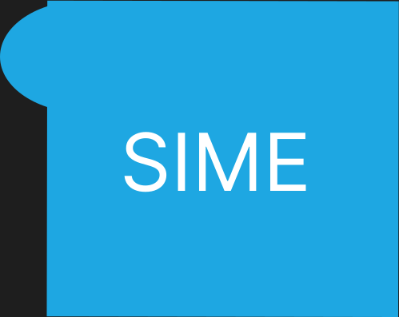

# SIME (Style Interactive Markdown Extension)

**SIME** is an extension to GitHub-flavored Markdown designed to add powerful styling, interactivity, and multimedia support — making your markdown files dynamic, visually rich, and easy to enhance without complex coding.

---

## What is SIME?

SIME stands for **Style Interactive Markdown Extensions**. It builds on the widely used GitHub Markdown format by introducing simple, intuitive syntax that lets you:

* Style text globally or selectively using classes
* Add interactive elements like clickable buttons with hover and fade effects
* Embed images, audio, and videos playable directly in markdown viewers
* Customize backgrounds and animations effortlessly

---

## Basic Syntax

### Global Styles

Add global styling commands at the top of your SIME markdown file:

```markdown
^tclr-ff0000^          // Set text color to red (hex without #)
^inv-clr-000000^       // Set background color to black (hex without #)
```

### Classes

Define and use style classes:

```markdown
^clsm-classname^       // Define a class named 'classname'
clst-classname Your text here    // Apply class to specific text
```

---

### Text Size

Control text size:

```markdown
size-1      // Normal size
size-5      // Largest size
```

---

### Media Embedding

Embed media files:

```markdown
element-elementname-img(filename.png)   // Image
element-elementname-vid(filename.mp4)   // Video
element-elementname-aud(filename.mp3)   // Audio
```

---

### Buttons & Interactive Effects

Make buttons and add effects:

```markdown
^inv-elementname-button-link(https://example.com)^    // Clickable button
^inv-elementname-button-hover(3)^                      // Hover intensity (1-5)
^inv-elementname-button-fade(2)^                        // Fade-in duration in seconds
```

For text fade effects (text must be inside a class):

```markdown
^inv-classname-text-fade(3)^
```

---

## Important Notes

* Style or interactive commands **must be wrapped with `^` at the start and end**.
* Hex colors are specified **without the `#`** symbol.
* If a style is **not inside a class**, it applies globally to the whole document.
* Text fade effects require the text to be inside a defined class.

---

## Example Usage

```markdown
^tclr-333333^
^inv-clr-f0f0f0^

^clsm-highlight^
clst-highlight This text is highlighted and styled.

^inv-visit-button-link(https://github.com)^
^inv-visit-button-hover(4)^
^inv-visit-button-fade(1)^
```

---

## SIME Cheatsheet

### Global Styles

| Command             | Description      |
| ------------------- | ---------------- |
| `^tclr-hexcode^`    | Text color       |
| `^inv-clr-hexcode^` | Background color |

### Classes

| Command            | Description         |
| ------------------ | ------------------- |
| `^clsm-classname^` | Define class        |
| `clst-classname`   | Apply class to text |

### Text Size

| Command  | Description  |
| -------- | ------------ |
| `size-1` | Normal size  |
| `size-5` | Largest size |

### Media Elements

| Format                          | Description |
| ------------------------------- | ----------- |
| `element-elementname-img(file)` | Image       |
| `element-elementname-vid(file)` | Video       |
| `element-elementname-aud(file)` | Audio       |

### Buttons & Effects

| Command                               | Description                       |
| ------------------------------------- | --------------------------------- |
| `^inv-elementname-button-link(url)^`  | Clickable button                  |
| `^inv-elementname-button-hover(1-5)^` | Button hover intensity            |
| `^inv-elementname-button-fade(sec)^`  | Button fade-in duration           |
| `^inv-classname-text-fade(sec)^`      | Text fade effect (requires class) |

---

## Personal Notes Cheat Sheet (Reminders)

* Always wrap commands with `^` at start and end.
* Hex colors **do not include** `#`.
* Classes must be defined before use.
* Text fades require the text to be inside the class with fade effect applied.
* Global styles apply to the entire document if not inside a class.

---

## Roadmap & Contributions

SIME is a work in progress! Contributions, suggestions, and bug reports are welcome.

* Open issues for bugs or feature requests.
* Submit pull requests with fixes or enhancements.
* Share your SIME markdown examples!

---

## License

MIT License © [Your Name]

---

Would you like me to help you with the initial GitHub repo setup or add some sample SIME markdown files to get started?
